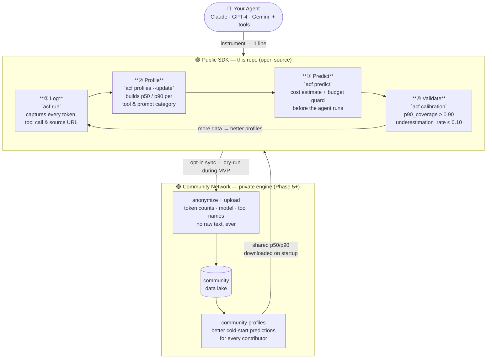

# Agent Cost Forecaster

> **Know what your AI agent will cost — before it runs.**

A logging-first cost profiler and budget guard for tool-using AI agents.

---

## Architecture



**How it works in 30 seconds:**
1. Wrap your agent with one line — `acf.patch()` or import `acf/integrations/anthropic.py`
2. Run `acf run` to log a prompt; it captures every token count, tool call, and source URL
3. Run `acf profiles --update` to build empirical p50/p90 cost distributions from your logs
4. Run `acf predict` to get a cost estimate and budget decision *before* your agent executes
5. Every run feeds back into the loop — predictions get more accurate over time
6. Opt-in sync shares your anonymized token stats with the community, improving cold-start predictions for everyone

**Two-repo structure:**
| Repo | What | Who can contribute |
|---|---|---|
| `AgentCost.ai` (this repo) | Open-source SDK: logging, profiling, sync, CLI | Anyone |
| `agentcost-engine` (private, Phase 5+) | Prediction engine, ML router, community server | Core team |

---

## How to Contribute

**The most valuable contribution: run the SDK.**
Every batch you run adds real execution data. Your anonymized token statistics (never raw text or prompts) flow to the community data lake and improve shared p50/p90 profiles for all tools — making cold-start predictions better for every new contributor.

**Code contributions (this repo):**
- `data/seed_templates.yaml` — add diverse prompts across `web_search`, `calculator`, `no_tool`, `ambiguous`
- `acf/integrations/` — add wrappers for new SDKs (OpenAI, Gemini, Mistral)
- `profiler.py` — improve p50/p90 profile computation or add new metrics
- `acf/sync/anonymizer.py` — strengthen privacy guarantees

Open an issue before starting any significant change.

---

## The Problem

Running a tool-using AI agent is expensive in ways that are hard to predict:

- **Tool schemas cost tokens** — every tool schema passed to the model is paid for on every call, even if the model never uses that tool.
- **Result size is variable** — a `web_search` can return 300 tokens or 3,000 tokens depending on the query.
- **Multi-step agents compound cost** — each tool call feeds results back into the next model call; costs multiply across turns.
- **Subscription billing hides the signal** — Claude Code Pro is a flat subscription, so you cannot see per-run cost without computing it yourself from token counts.

Agent Cost Forecaster solves this by logging everything, profiling the distributions, and returning a p50/p90 cost estimate before the agent runs.

---

## How It Works

```
Stage 1 — Log:      acf run              → observe model calls + tool calls → log tokens, URLs, api_equivalent_cost_usd
Stage 2 — Profile:  acf profiles         → compute p50/p90 per tool and prompt category
Stage 3 — Predict:  acf predict          → estimate cost from empirical profiles → apply budget guard
Stage 4 — Validate: acf run-batch --heldout → compare predicted vs actual → p90 coverage
```

**Logging comes first.** Before any real prediction, you need at least 100 logged runs. The system surfaces this constraint explicitly — there are no fake numbers before data exists.

---

## Quick Start

```bash
git clone https://github.com/your-org/agent-cost-forecaster
cd agent-cost-forecaster
pip install -r requirements.txt

# Set your Anthropic API key and prompt hash salt
export ANTHROPIC_API_KEY=sk-ant-...
export PROMPT_HASH_SALT=your-random-salt

# Configure your target agent
cp config/agent_config.yaml.example config/agent_config.yaml
# Edit: model, system_prompt, tools, budget limits

# Run a single prompt and log the result
acf run "Find the latest Nvidia quarterly revenue." --log

# Generate synthetic tasks and run a batch
acf generate-tasks --n 100 --strategy template
acf run-batch --limit 100 --model claude-haiku-4-5-20251001

# Build empirical profiles from logs
acf profiles --update

# Predict cost for a new prompt
acf predict "Find Nvidia's latest revenue and calculate YoY growth."

# Check calibration
acf calibration
```

---

## CLI Reference

```bash
# Predict cost before running
acf predict "..."
acf predict "..." --model claude-sonnet-4-6 --tools web_search,calculator --budget 0.05

# Run a single task and log it
acf run "..." --log

# Batch operations
acf generate-tasks --n 100 --strategy template
acf run-batch --limit 100 --model claude-haiku-4-5-20251001
acf loop --n 100 --update-profiles            # generate + run + update in one step

# Inspect results
acf profiles --update
acf profiles --show
acf compare --run-id run_001                  # predicted vs actual for a run
acf trace --run-id run_001                    # full model call → tool call chain
acf sources --run-id run_001                  # source domains used

# Optimization
acf suggest-tools "Find Nvidia earnings and calculate YoY growth"

# Calibration
acf calibration

# Export
acf export --format jsonl --output ./data/training.jsonl
```

Output is a readable table by default. Pass `--json` for raw JSON output.

---

## Key Concepts

### API-Equivalent Cost vs. Cash Cost

All profiling, p50/p90 estimation, calibration, and budget guard comparisons use **API-equivalent imputed cost** (`api_equivalent_cost_usd`): token counts × provider public pricing, regardless of billing arrangement.

Under Claude Code Pro subscription, the marginal per-run cash cost is zero. The system tracks this separately in `actual_cash_cost_usd`. Every run carries a `billing_mode` and `cost_basis` field so the distinction is never ambiguous.

```
api_equivalent_cost_usd =
    input_tokens / 1M × input_price_per_1m
  + output_tokens / 1M × output_price_per_1m
  + cache_read_tokens / 1M × cache_read_price_per_1m
  + cache_write_tokens / 1M × cache_write_price_per_1m
```

### Tool Schema Tokens — The Hidden Cost

Schema tokens are paid for **all exposed tools** on every model call, whether or not the model uses them. A caller passing 15 tool schemas "just in case" pays ~2,000 tokens per call for schemas the model never touches.

Agent Cost Forecaster always lists `tool_schema_tokens` first in its cost driver output and can suggest a minimal tool set for any prompt:

```
acf suggest-tools "Find Nvidia latest earnings and calculate YoY growth"

Recommended exposed tools: web_search, calculator
Do not expose: file_search (not predicted for this prompt type)
Estimated schema token saving: 380 tokens
```

### Budget Guard

Every `acf predict` call returns a budget decision with a clear boolean gate:

```json
{
  "budget": {
    "limit_usd": 0.02,
    "status": "warning",
    "should_execute": true,
    "reason": "p50 API-equivalent cost is within budget but p90 exceeds the limit."
  }
}
```

`status` values: `safe` / `warning` / `blocked` / `unknown`

### Calibration Target

The two primary metrics are:

| Metric | Target |
|--------|--------|
| `p90_coverage` | ≥ 0.90 — fraction of runs where actual cost ≤ p90 estimate |
| `underestimation_rate` | ≤ 0.10 — fraction of runs where actual cost > p90 |

`acf calibration` prints both metrics with per-tool breakdown.

### Traceability

Every prediction and execution is linked by a shared `trace_id`:

```
trace_id
  → prediction_id      (pre-run estimate)
  → run_id             (execution)
      → model_call_id  (each model API call)
          → tool_call_id (each tool invocation)
```

`acf trace --run-id run_001` renders the full chain in the terminal.

---

## Target Agent: Claude Code

The first target runtime is Claude Code, instrumented via the Anthropic Python SDK. The system calls the same Claude models Claude Code uses, routes all tool calls through an observed wrapper, and logs every `messages.create()` call.

Tools in the MVP:
- `web_search` — high variance result size; the most interesting tool to profile
- `calculator` — deterministic; acts as a control
- `no_tool` — tests false positive suppression

MCP tool wrapping is deferred to Milestone 2.

### Pricing Reference (API-equivalent, per 1M tokens)

| Model | Input | Output | Cache Read | Cache Write |
|-------|-------|--------|------------|-------------|
| `claude-haiku-4-5-20251001` | $0.80 | $4.00 | $0.08 | $1.00 |
| `claude-sonnet-4-6` | $3.00 | $15.00 | $0.30 | $3.75 |

---

## Privacy

Default privacy mode: `synthetic_only` — full data for synthetic runs, hashed metadata only for production runs.

Production prompt text is hashed with a salted SHA-256 before storage. Source URLs are always stored. `result_tokens_raw` and `result_tokens_inserted` are always stored regardless of privacy mode — they contain no raw text.

| Mode | Behavior |
|------|----------|
| `off` | Store everything. Local development only. |
| `hash_only` | Hashes and metadata; no raw text. |
| `redact_pii` | Remove emails, names, phone numbers. |
| `synthetic_only` | Full data for synthetic; metadata only for production. |

---

## Data Storage

SQLite for the MVP. Zero infrastructure, trivial to back up, exports cleanly to CSV/JSONL/Parquet. Schema is Postgres-compatible for a future migration.

Core tables: `predictions`, `agent_runs`, `model_calls`, `tool_calls`, `tool_profiles`, `model_pricing`, `agent_configs`.

---

## Six-Week Roadmap

| Week | Deliverable |
|------|-------------|
| 1 | Logging infrastructure: SQLite schema, executor, `acf run` |
| 2 | Batch logging: 100 runs end-to-end, source URL tracking (**Milestone 1**) |
| 3 | Empirical profiles: p50/p90 per tool, `acf trace`, `acf sources` (**Milestone 2**) |
| 4 | First prediction mode: `acf predict`, budget guard, cost drivers |
| 5 | Held-out evaluation: p90 coverage ≥ 0.90 on new prompts (**Milestone 3**) |
| 6 | User validation: CLI polish, demo, 10 conversations with agent builders |

Everything else — FastAPI, Postgres, embedding router, ML classifier, dashboard — is deferred until after Milestone 3 is validated with real users.

---

## Architecture

See [architecture.md](architecture.md) for the full technical design: data model, module reference, API design, calibration pipeline, and design principles.
